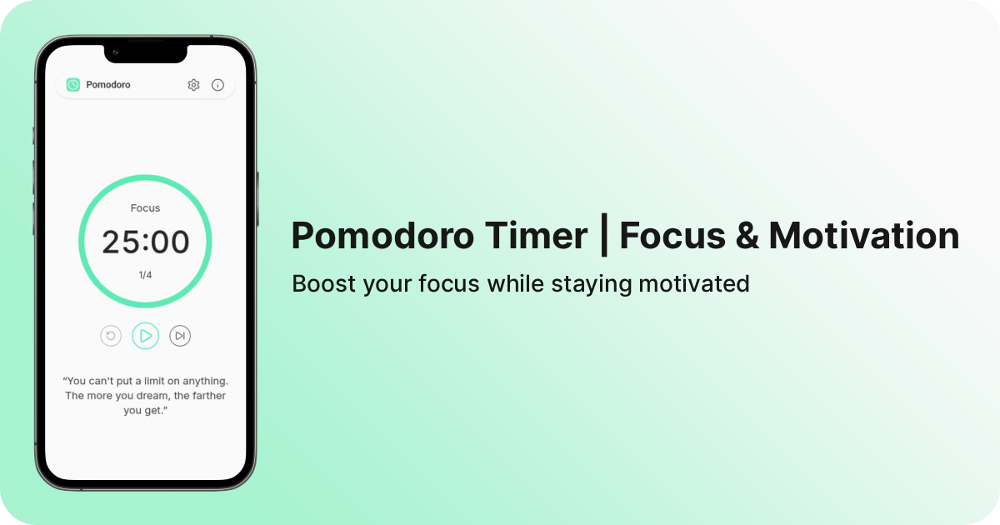

## Pomodoro

<a href="" target="_blank" rel="noopener">Live demo</a>

Customisable web-based Pomodoro timer featuring motivational quotes, auto-saving adjustable settings, desktop notifications, light/dark themes and more

### 📋 Features

- Customisable timer (focus, short/long break, rounds, auto-start option)
- Play/pause, restart and skip controls
- Circular progress indicator for each session
- Desktop notifications
- Adjustable notification volume
- Option to show or hide motivational quotes; refresh quote on demand
- Light and dark themes
- Settings auto-saved to localStorage (debounced)
- Fully responsive for desktop and mobile

### 🖼️ Screenshots

### 🛠️ Built With

  
  
  

